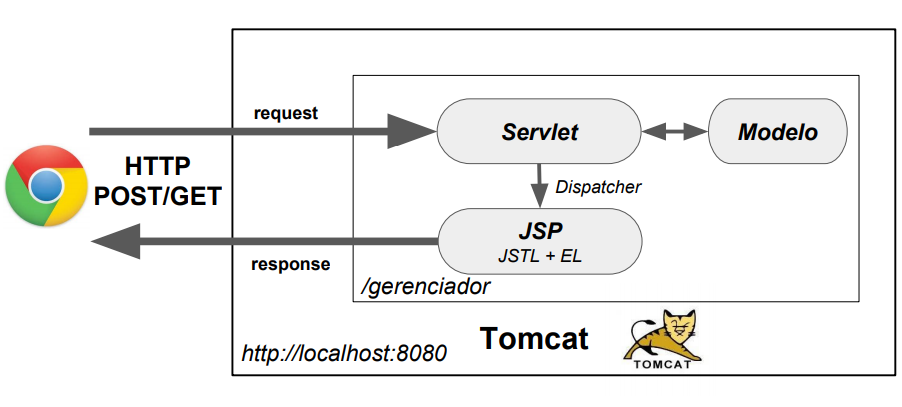

# Web Applications using Java

### Background

[Java](https://www.java.com/en/) has still the largest share of enterprise applications and programmers. It has a mature infrastructure that scales, huge community, good documentation and tutorials and it is simply the Object Oriented Language to go. Many books with advanced topics in programming use Java and it is natural that any programmer aimed to advance in its career, face Java at some point.

This next project is a Beginner's immersion to Java Web Applications. First part, it is devoted to bring to light some concepts, and the second part is about the project per se.

#### 1.0 Web development

If you develop a web application (independent of the programming language your are using), you typically put your web application on a dedicated server (and not your local computer). The web application runs on the server and people can access it there. The server is either a real machine (with CPU, memory, harddisk, etc.) or a virtual server which is basically a machine which is separated by software into smaller machines.

It is possible to use your local computer as a server, but usually you want to have a fixed server which runs 24 hours per day, 7 days per week so that web clients can always reach your server under a pre-defined address.

Instead of running your application directly on a dedicated server, you could also run it in a cloud environment. This cloud environment provides the necessary server for your application. An example for this is the Google App Engine which allows to host web applications written in different programming languages.

#### 1.1 Java web or Java EE container

Java web applications are typically not running directly on the server. Java web applications are running inside a web container on the server.

The container provides a runtime environment for Java web applications. The container is for Java web applications what the JVM (Java Virtual Machine) is for local running Java applications. The container itself runs in the JVM.

In general, Java distinguishes two containers: the web container and the Java EE container. Typical web containers in the Java world are [Tomcat](http://tomcat.apache.org/) or [Jetty](https://www.eclipse.org/jetty/). A web container supports the execution of Java servlets and JavaServer Pages. A Java EE container supports additional functionality, for example, distribution of server load.

Most of the modern Java web frameworks are based on servlets. Popular Java web frameworks are [GWT](http://www.gwtproject.org/overview.html), [JavaServerFaces](http://www.javaserverfaces.org/), [Play!](https://www.playframework.com/), [Struts](https://struts.apache.org/) and the [Spring](https://spring.io/) framework. These web frameworks usually require as a minimum container a web container.

#### 1.2 Java web application

A Java web application is a collection of dynamic resources (such as Servlets, JavaServer Pages, Java classes and jars) and static resources (HTML pages and pictures). A Java web application can be deployed as a WAR (Web Archive) file.

The file web.xml is the standard deployment descriptor for the Web application that the Web service is part of. It declares the filters and servlets used by the service.

A WAR file is a zip file which contains the complete content of the corresponding web application.

#### 1.3 Java web standards

Standard Java technologies are defined via a standard process called the Java Community Process (JCP). The following technologies are defined via the JCP.

1.3.1. Servlet

A `servlet` is a Java class which extends the capabilities of the web servers and responds to incoming request within a web container. It can also respond to any requests, and it is a web component to create dynamic web pages.

1.3.2. JavaServer Page

`Java Server Pages` (JSP) are files which contain HTML and Java code. It is automatically processed by Tomcat. The java code inside html pages are called `scriplets` and are written between `<% %>`. They generate html dynamically.

We use `RequestDispatcher` to call a JSP page from a servlet and use the request to pass or get an attribute (`setAttribute` or `getAttribute`).

1.3.3. JavaServer Pages Standard Tag Library

Expression language (EL) is a simple language to print the result of an expression. It uses the syntax `${ .. }`.

The Java Server Pages Standard Tag Library (JSTL) encapsulates the core functionality common to many Web applications as simple tags.

EL and JSTL are used together.

#### 2.0 [Deploy the Java Web App inside a Tomcat server container](https://www.jetbrains.com/help/idea/deploying-a-web-app-into-an-app-server-container.html#7856c84f)

Do not forget to initialize the docker container, then in IntellJ, go to services and run it.

As the code changes, you need to build artifacts again and rerun the service.
This project was created using IntelliJ, project dialog selecting `Java Enterprise`, `Maven` as the build tool and `JUnit` as the test runner.
In the Libraries and Frameworks list, selected the `Web Profile` specification and clicked Next.

Credits:
- Alura - [Java Servlet - Foundations of web java programming](https://cursos.alura.com.br/course/servlets-fundamentos-programacao-web-java)
- Vogella - [Introduction to Java Web development - Tutorial](https://www.vogella.com/tutorials/JavaWebTerminology/article.html#:~:text=A%20Java%20web%20application%20is,WAR%20(Web%20ARchive)%20file.)

### Notes

